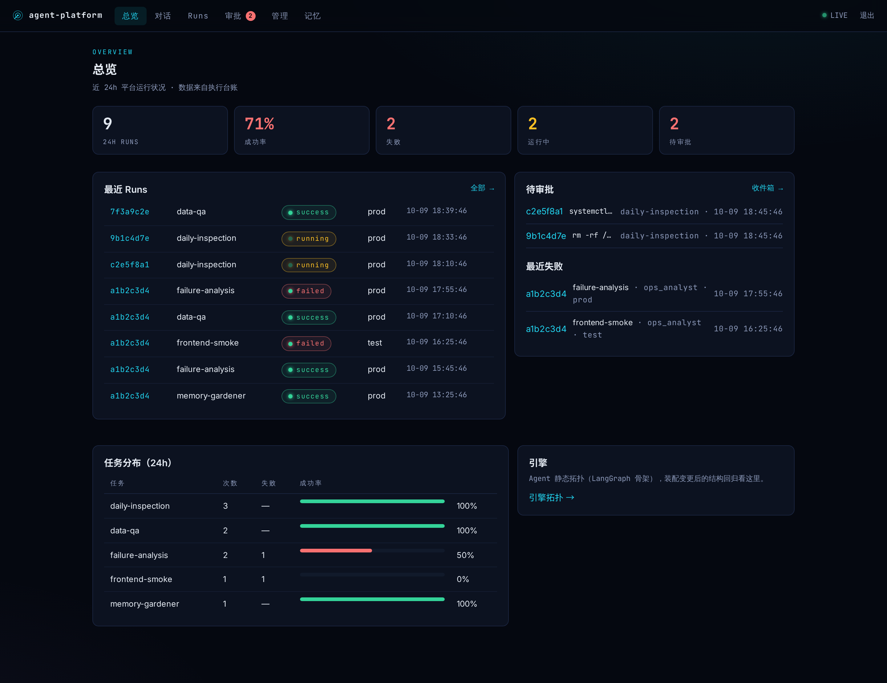
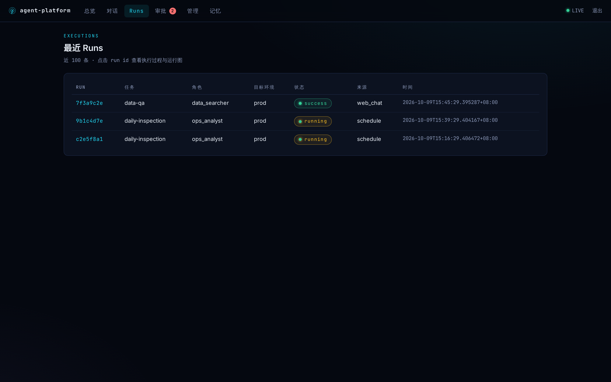
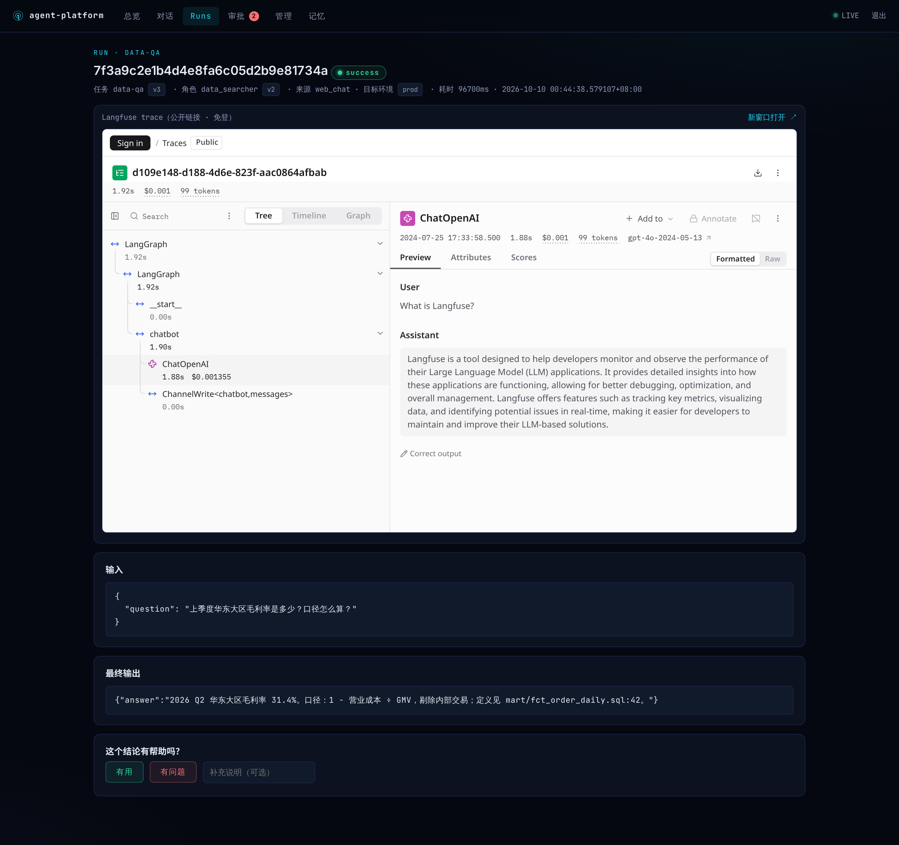
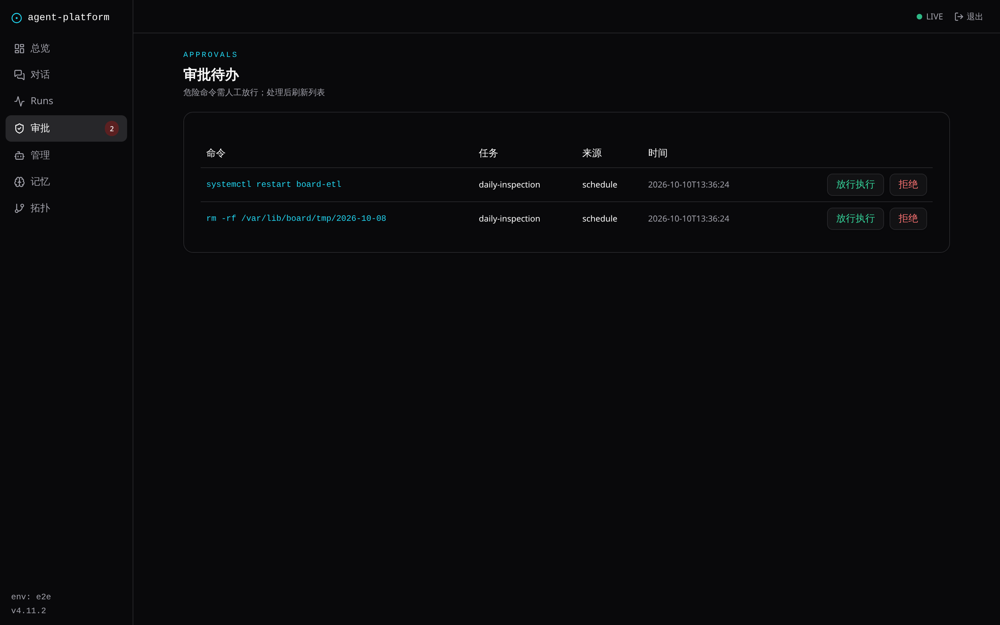
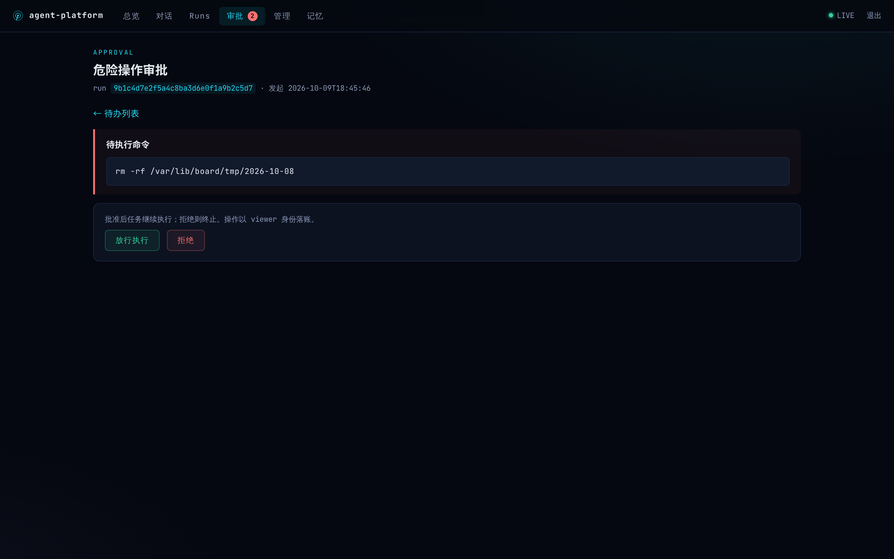
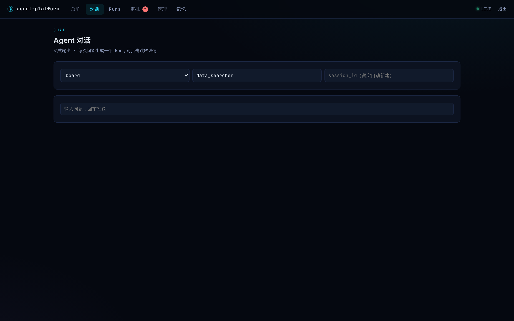
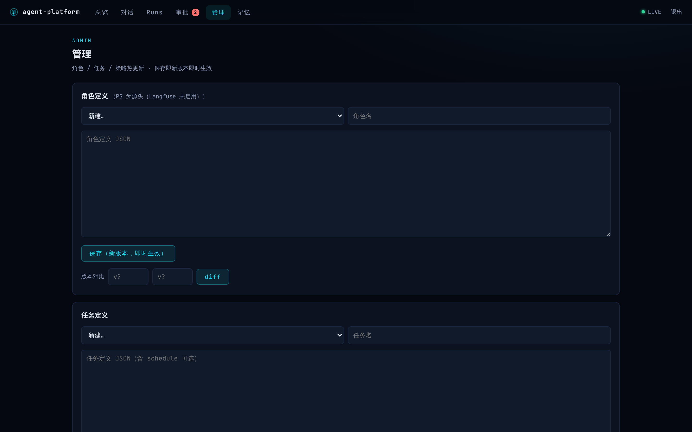
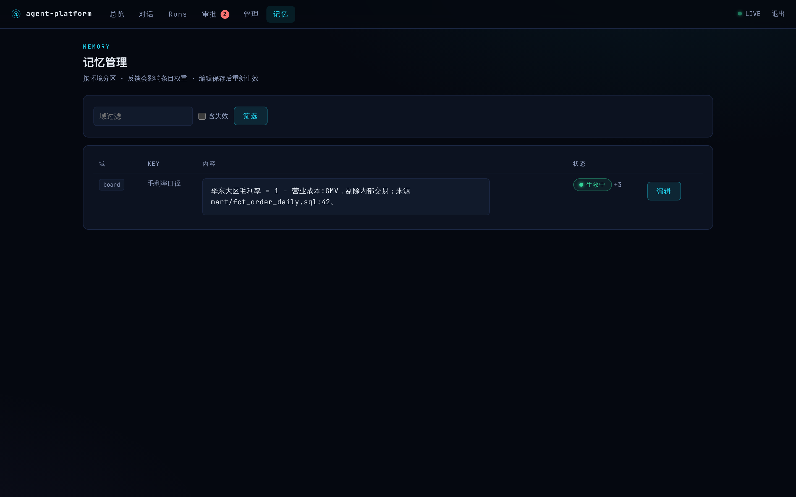
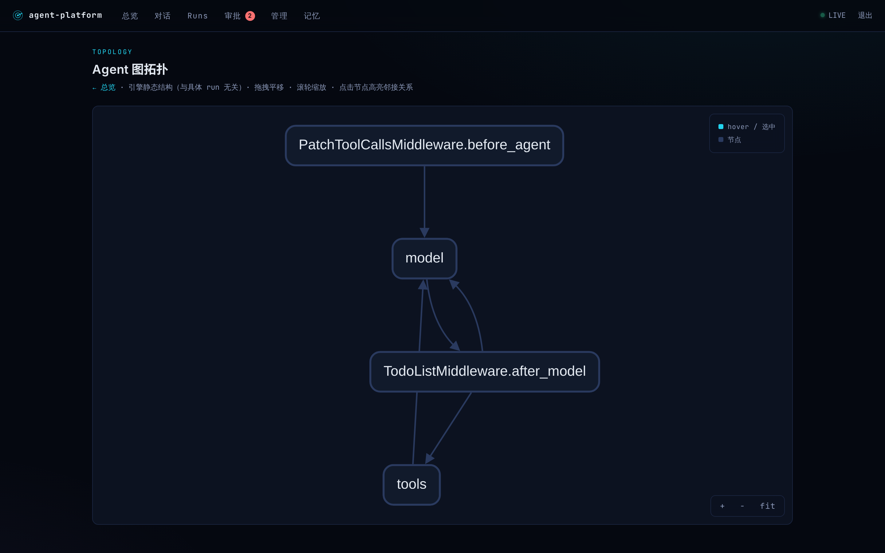
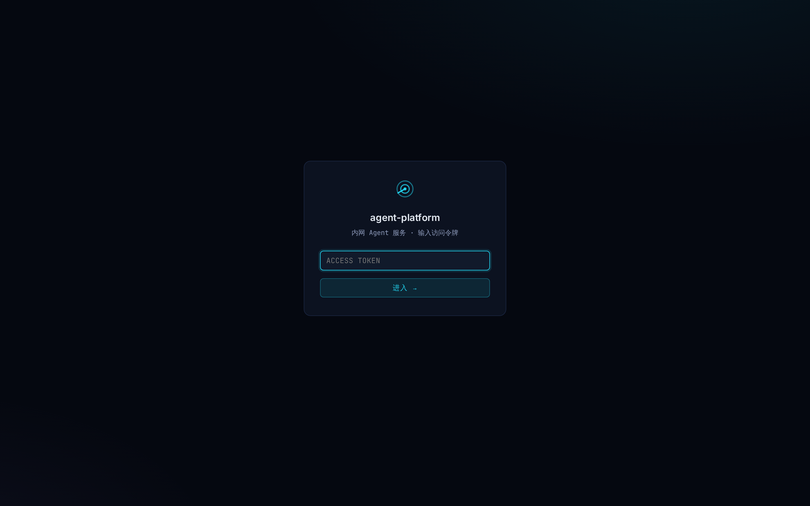

# agent-platform 设计文档

版本：v4.8。读者：协作开发者。目标：看完本文即可定位任何功能的代码位置。

## 1. 定位与约束

内网 Agent 服务平台，为业务系统（Dagster、看板 board、配置中心）提供
报错分析、数据口径问答、定时巡检等能力。**单部署多目标环境**：一套服务
操作 prod/test/dev 多套业务环境，请求级 `env` 字段区分操作对象（见 §3.10）。

硬约束：

- 单部署：agent 服务只部署一份；业务环境差异是**请求维度**，不是部署维度
- 无用户体系：服务间调用只有一个固定 bearer token；/v1 与 webhook 统一校验（hmac.compare_digest），Viewer 页面走 cookie 登录（httponly，未登录 307 跳 /login），页面内 JS 调 /v1 由同源 cookie 兜底
- 单一内部模型 API（OpenAI 兼容），多 token 轮询
- 无容器：主机 + systemd 加固，沙箱用 bwrap（namespace 隔离）
- 角色/任务定义热生效：写 DB 即生效，不重启
- 钉钉单向中继：只发不收，交互闭环在 Run Viewer 页面上完成

## 2. 分层架构

依赖单向向下；跨层只走对方包的公开出口。新人读代码时，**每个文件不求助于
三个以上其他文件即可看懂**是本分包的硬标准。

```
api/        接入层：FastAPI app + /v1 路由 + 鉴权 + 请求模型
triggers/   触发层：dagster_sensor（规则先行）/ gitlab_webhook / chat（SSE）
orchestration/  编排层（Temporal）
  spec.py       RunSpec：一次 run 的完整规格（本层唯一数据结构）
  tasks.py      任务类型注册表（DB 声明 + 热生效；三种形态：artifacts/handler/单 agent）
  policies.py   提交闸门链：env_gate → DB 声明策略（deny/require_approval）
  artgraph.py   资产化任务图：纯逻辑解释器（topo 分层 + 层内并行 + map/route/gate）
  submitter.py  提交端：submit / run_sync / correct / resume_run / approve_start
  workflows.py  AgentRun / ArtifactRun / BuiltinTask 三个 Workflow + Schedules 同步
  activities.py 执行步骤 + 资产图 IO（art_materialize/art_gate/art_mark）+
                内建任务处理器（HANDLERS）+ 依赖注入（configure/Deps）
  worker.py     Temporal Worker 装配
agent/      agent 层
  roles.py      角色定义/继承解析（交集收敛防提权）/DeepAgents 装配
  engine.py     agent 生命周期：按需构建、TTL 惰性重建、热加载
  approvals.py  危险命令审批：DB 行是事实源，LISTEN/NOTIFY 毫秒唤醒；
                另有 list_pending/pending_count 供控制台审批收件箱与角标
  tools/        工具层（见 §5）
memory/     记忆层：recall（运行前）/ distill（运行后）/ gardener（夜间维护口子）
store/      存储层：db（连接池+schema 唯一建表点）/ runs / definitions /
            knowledge（crud/retrieval/temporal/profiles）/ cases / feedback /
            artifacts（资产图产物：血缘 + 输入指纹复用）
model/      模型连接池：token 轮询 + 限并发 + 失败换 token
langfuse.py Langfuse 门面（官方 SDK 负责 prompt/score；平台保留 last-known
  + PG 写穿降级链）+ OTEL trace 管线（enabled=false 全空操作）
notify/     钉钉中继（四种消息形态）
web/        控制台前端（v5.0.0 起）：React + TS + Vite + Tailwind + shadcn/ui
            SPA，HashRouter；src/pages 一页一文件，src/lib/api.ts 定义
            Api 接口（httpApi 打 /v1/console/*，?demo=1 切内存假后端）；
            npm run build 产物 web/dist 由 FastAPI 静态托管
            （api/console.py 数据端点 + web_static.py 托管/旧深链 301）
main.py     装配入口：lifespan 内完成全部真实装配，无占位无延迟绑定
```

## 3. 关键设计决策

### 3.1 编排：Temporal durable execution

- workflow id = run_id；续跑 = 同 id 重新 start，
  `WorkflowIDReusePolicy.ALLOW_DUPLICATE_FAILED_ONLY` 只允许顶替终态执行
- 任务三种形态对应三个 workflow：单 agent（AgentRun）/ 资产图（ArtifactRun，
  run_graph 解释执行）/ 内建处理器（BuiltinTask，如 memory-gardener）
- Temporal Schedules 替代 pg_cron；任务定义的 schedule 字段启动时幂等同步
- run_agent 步骤不自动重试（模型/工具错误走人工或恢复路径）；
  prepare/finalize 轻量 DB 操作允许 3 次重试
- 审批等待在 activity 内 DB+NOTIFY 挂起 + heartbeat，Temporal 视为活跃

### 3.2 会话：概念唯一 session_id，episode 制

- 只有 session_id 一个概念；run 无会话归属时 session_id = run_id（自会话）
- session_id 即 LangGraph thread（checkpointer 持久化，崩溃断点续跑），
  但这是实现细节，不出 engine 层
- Dagster 报错场景：`dagster:{asset}:{error_class}:{date}`——
  episode 按天滚动，同类故障历史连续，跨类自动开新线
- 上下文不会长到爆：thread 只装本次故障周期，**连续性由记忆层承载**

### 3.3 记忆层：召回与沉淀

召回（recall，运行前拼 prompt）自上而下四层：

1. **资产档案**（`asset:{key}:profile`）：逐字保留、永不摘要，置顶
2. **前序交接摘要**（`session:{prefix}:{episode}:summary`）：四节模板——
   结论 / 被否方案 / 当前约束 / 未决问题（Compaction Cliff 的教训：
   散文摘要最先丢被否方案，而故障分析里"排除了哪些方向"最值钱）
3. **历史知识**：pg_trgm + pgvector 混合召回，RRF 融合（k=60，只认排名）；
   code_ref 带 commit，召回时校验新鲜度，漂移即标记 expired
4. **同类案例**：报错指纹归一化（抹掉数字/十六进制/引号/路径后 hash）

沉淀（distill，运行成功后）：一次轻量模型调用提炼知识/案例入库；
有 session 时另写交接摘要。沉淀失败不影响主流程。

### 3.4 纠正式反馈

`POST /v1/sessions/{sid}/feedback` → Submitter.correct：
从 session 最近 run **继承** task_type/role/domain（不调用方传、不写死），
新 run 在同一 session 带着纠正重判；finalize 时把**最近一次** run 沉淀的
知识/案例置 valid_to（不误伤更早的正确历史），再沉淀新结论。

同 session 被纠正 ≥3 次 → 管理页提示人工升舱为角色 prompt
（程序记忆升舱保持人工门）。

### 3.5 角色继承：收敛而非提权

- domains / tools 与父角色取**交集**——子角色只能收敛，不能扩张
- prompt = 父 prompt + prompt_append 拼接
- 加载时校验循环继承与父角色存在性

### 3.6 提交闸门链（policies.py）

所有"这个任务该不该发起"的判断收进唯一入口 `evaluate_submit`，按序短路：

1. **env_gate**（内置）：任务级环境门禁
2. **DB 声明策略**：definitions 表 kind="policy"，按 order 升序；
   正则作用于 任务名 + 输入 JSON + question，命中即按 action 处理：
   - `deny` → 直接拒绝（TaskRejected）
   - `require_approval` → 建行不启动（run 停 queued）+ 审批单 + 钉钉卡片；
     批准 → `approve_start` 首次启动 workflow（不是 resume——没有可续的
     thread），拒绝 → run 置 failed

不在链里的东西：dedup（是"合并到已有 run"，不是闸门决策，留在 Submitter）；
执行期危险命令审批（agent/approvals.py，管"这条命令该不该跑"）——
两层互补，一个管发起，一个管执行中。策略与角色/任务同机制：
DB 声明、版本化、写后即时生效，Admin API/管理页维护。

### 3.7 资产化任务图（artgraph.py）

静态 steps DAG 假设"工作的形状事先已知"，而 agent 任务的核心特征是未知。
所以任务图以**产物**为节点、**依赖**为边（数据流，不是控制流），
动态性只收进两个受控出口：

- 节点恰好声明一种物化方式：`code`（CODE_NODES 注册表里的内核函数，
  不过模型）/ `agent`（角色 + 产出契约，依赖产物以摘要注入，大产物用
  read_artifact 工具按需读）/ `route`（受限枚举选一——动态性出口①）
- 修饰：`map`（对上游 list 产物逐项扇出，运行时才知道几个——动态性出口②）
  / `gate`（`when` 条件命中 → 人工审批通过才物化，否则节点跳过、下游连带跳过）

执行语义：拓扑分层 + 层内并行（并行度是依赖关系的推论，不用声明）；
每个产物落 artifacts 表并带**输入指纹**（节点定义 + 实际输入的 sha256），
重跑时指纹未变的节点直接复用旧产物（本 run 优先，跨 run 取最新）——
这就是选择性再物化：只跑失败节点和下游脏节点。定义变更自动撑爆指纹
（定义在 hash 里），不需要手动失效。

解释器 `run_graph(spec, call)` 是纯逻辑：IO 全部经 `call(fn, *args)` 注入，
prod 里 `call = workflow.execute_activity`，测试里直接 await——
编排语义与 IO 解耦，单测不需要 Temporal。

### 3.8 域包（conf/domains/\<name\>/）

域知识从内核搬进域包，平台团队维护内核、业务团队 PR 自己的域包：

- `domain.yaml`：code_paths / readonly_dsn / hosts（该域服务实际部署的机器，
  host_metrics 查监控用）（与 common.yaml 内联声明深合并，内联优先）
- `rules.yaml`：规则分类器（dagster_sensor 的规则先行）
- `session.yaml`：episode 命名模板
- `tasks.yaml`：域自带种子任务（failure-analysis 住 dagster 包，frontend-smoke 住 board 包）

### 3.9 记忆园丁（gardener.py，#5 的口子）

记忆层的新陈代谢，定位为夜间低频维护作业（内建任务 memory-gardener，
种子默认不带 schedule；Admin 给任务定义加 cron 即启用，零新组件）。

- 已实现：**漂移巡检**——全库 code_ref 批量校验 commit 新鲜度，
  不一致标 expired（比召回时的惰性校验更主动：召回只管被命中的条目）
- 预留口子（接口就位，需求成熟时实现）：`decay()` 反馈分半衰期衰减、
  `find_conflicts()` 矛盾条目写"待仲裁"反馈（复用管理页升舱提示这条现成人门）

### 3.10 目标环境维度（单部署多环境）

`settings.env` 降级为**实例标签**：本套部署自己是谁，只用于定义/种子/策略的
存取命名空间（一套部署一套定义）。run 操作的**业务环境**是请求级维度
`target_env`，与实例标签正交：

- **入口**：`/v1/ask`、`/v1/tasks`、`/v1/chat(.stream)` 的请求体 `env` 字段；
  dagster_sensor / gitlab_webhook 按来源环境上送；Viewer 对话页/列表页/
  记忆页带环境选择器；SDK/CLI 加 `--env`。缺省 = `default_target_env`
  （再缺省 = `target_envs[0]`，未配 `target_envs` 则退化为实例标签——
  单环境部署零感知）
- **贯穿**：`runs.target_env` 列落库；提交闸门链里 env_gate 与策略
  `PolicyDef.envs` 都按 target_env 判（"这个任务能不能打 prod"是目标环境
  问题，与部署在哪无关）；记忆层（knowledge/cases/反馈传播）按 target_env
  分区——prod 沉淀的口径不会污染 test 的召回；资产图产物同样按 target_env
  分区——跨 run 复用只在同环境内发生（test 物化的产物不能记到 prod 的账上）；
  域连接信息经
  `DomainConfig.for_env(target_env)` 取 `envs` 覆盖（深合并，一套定义连多套库）
- **校验**：配了 `target_envs` 后，请求带列表外的 env 直接拒绝
  （`resolve_target_env`，拼错环境名 = 打错环境，必须启动期/提交期暴露）
- 园丁逐环境巡检：内建 memory-gardener 对每个 target_env 跑一轮，
  输出按环境分组

## 4. 配置

`conf/base/common.yaml`（共享默认：模型/钉钉/temporal/审批模式/业务域静态拓扑）+ `conf/env/{env}.yaml`（只写差异，dict 深合并覆盖），
`${VAR}` 从环境变量插值，未设置启动即报错（配置问题暴露于启动期）。
`Settings` 扁平结构（config.py 一个文件看全）。

目标环境相关三个键（都不配 = 单环境部署）：

- `target_envs: [prod, test, dev]`：本实例可操作的业务环境白名单
- `default_target_env`：请求缺省 env 时的落点（建议指向 test——生产操作
  必须显式声明，是"默认安全"而非"默认方便"）
- `domains.<name>.envs.<env>`：域连接信息按环境覆盖（如 readonly_dsn、hosts），
  与基座深合并；`DomainConfig.for_env()` 在执行期解析

监控接入一个键（不配 = host_metrics 工具不注册）：

- `grafana: {url, datasource_uid, token}`：Grafana 地址 + Prometheus 类型
  数据源的 uid + 只读 service account token；查询走 datasource proxy
  （后端地址/认证收口在 Grafana，平台只见一个 token）

## 5. 工具层

分层：

| 层 | 工具 | 用途 |
|----|------|------|
| L0 | bash | 通用兜底（bwrap 沙箱：全盘只读/仅 scratch 可写/默认断网） |
| L2 | run_code | CodeAct：agent 写 Python 一次编排多工具，中间数据不进上下文 |
| 薄工具 | sql_query / host_metrics / dingtalk_send / update_asset_profile | 带结构化校验的常用能力 |
| L1 | MCP 桥 | 内部服务的类型化接口：browser / datahub 直接接官方实现（微软 `@playwright/mcp`、DataHub 官方 `mcp-server-datahub`，配置见 conf/env/prod.yaml），仓库只自带 `mcp_servers/dagster_mcp.py`（内部 GraphQL 报错分析，无现成实现） |

- 每个工具在 `tools/registry.py` 只定义一次；`resolve()` 给 LLM（LangChain 壳），
  `host_tools()` 给 run_code 桩函数（无壳），同一实现
- run_code 协议：沙箱子进程执行 agent 代码，桩函数经 stdio JSON 行
  （`\x00RPC ` 前缀）RPC 回 host 执行真实工具——host 是策略锚点（审查/鉴权/审计）
- 审查层与工具解耦：bash 命令与 run_code 代码走同一组危险模式审批
- sql_query 防线：单语句 + 只读事务 + statement_timeout=15s + 200 行上限
- host_metrics 防线：指标集固定（node_memory/node_load1/node_cpu/node_filesystem），
  PromQL 全由代码拼（instance 正则转义主机名，LLM 只选 domain/env）；
  经 Grafana proxy 查询不直连 Prometheus；采不到的主机显式列「无数据」；
  监控故障返回结构化错误不炸 run
- **为什么 bash 断网**：命令是 LLM 现场拼的，正则审批只拦得住 `rm -rf`，
  拦不住"GET 无害、POST 危险、这台机器不该碰"的 API 语义；要出网的能力
  全部收口成薄工具/MCP，把数据源与调用方式固化在代码里

## 6. 安全模型（由内到外）

1. systemd：低权限用户 + ProtectSystem=strict + 仅 scratch 可写 + NoNewPrivileges
2. bwrap：子进程 namespace 隔离；不可用时退化直接跑并记警告
3. 审批：危险模式（rm -rf/drop/truncate/kill/systemctl 等）挂起等人工放行，
   超时视同拒绝（安全侧默认）
4. 环境变量白名单：密钥不进模型上下文

威胁模型：内网可信用户 + 防误操作（不是对抗性代码）。

## 7. 存储 schema

`store/db.py` 是全库唯一建表点（启动幂等执行）。八张表：

- `runs` / `run_events`：执行台账与事件流（审计与排障的事实源）；
  `runs.target_env` 记录该 run 操作的业务环境（§3.10），knowledge/cases
  的 env 列同样填目标环境而非实例标签
- `definitions`：角色/任务/策略版本化定义（最新版本即生效，历史全留可回滚）；
  run 在 prepare 时固定所用版本（`runs.task_version`/`role_version`），
  排查可 diff 任意两版（管理页 `/admin/diff`），保存新版本时提示近 24h 旧版影响面
- `artifacts`：资产图产物（PRIMARY KEY(run_id, name) + target_env + input_hash +
  status：materialized/reused/skipped/rejected）——血缘与重跑复用的事实源，
  复用查询限定同一目标环境
- `knowledge`：知识库（时序化 valid_from/valid_to/superseded_by + expired +
  feedback_score + embedding）
- `cases`：案例库（报错指纹，UNIQUE(env, fingerprint)）
- `feedback`：反馈（rating=打分 / correction=纠正）
- `approvals`：审批单（执行期危险命令 + 提交闸门 + 产物闸门共用）

## 8. 观测

- Run Viewer（自托管）：总览页 `/`（近 24h 聚合仪表盘：状态计数/成功率/
  失败/运行中/待审批五张统计卡 + 最近 Runs + 待审批/最近失败 + 任务分布
  成功率条形图，SQL 聚合在 `store/runs.py: overview()`）/ 引擎拓扑页
  `/graph`（Agent 静态结构，cytoscape + dagre，拖拽/缩放/点击节点高亮邻接；
  与具体 run 无关，从总览页「引擎拓扑 →」进入）/ runs 列表页（目标环境过滤）/
  run 详情（**Langfuse trace 页整页 iframe 内嵌**（v4.10.0 起，深层观测直接
  用官方 UI：span 树/耗时/成本/prompt/token 全套，控制台不重复造；trace
  打开详情页时自动设为公开链接免登，内网前提；有未决审批时页顶挂 ⏸ 待审批
  横幅）——不可内嵌时显示说明卡 + 新窗口外链（不自造轨迹图：Langfuse 是
  整套部署的硬依赖，观测不重复造）。**步骤时间线始终渲染**
  （内嵌模式下它是节点级反馈的唯一载体）：每步 👍👎（v4.11.0 起，
  kind=step + step_seq 留痕 feedback 表；Langfuse 回写经 match_observation
  把步骤 seq 映射到 observation id，score 直接挂对应 span——等价 UI 的
  Annotate 但走 public API，不需要登录态；映射不上降级 trace 级 score
  `step#seq`；单步评分不传播记忆）。**终态 run 头部带重跑按钮**（v4.11.0
  起，POST /runs/{id}/rerun → Submitter.rerun：失败/终止 → 同 id 断点续跑
  （ALLOW_DUPLICATE_FAILED_ONLY），成功 → 同输入新开 run 且跳过去重，
  trigger_source=rerun 留痕）。资产图任务渲染产物血缘
  图，按 materialized/reused/skipped/rejected 染色；详情头带目标环境徽章）/
  审批页（`/approvals` 收件箱列表是钉钉 deep-link 之外的兜底入口，
  顶栏「审批」挂待办数角标，on-load 拉一次不轮询；`/approvals/{run_id}`
  处理页）/ 对话页（环境选择器）/ 管理页（角色/任务/策略定义 + 版本 diff）/
  记忆管理页（按目标环境分区查看）

  页面实景（v4.8.0 全栈截图，见 `docs/screenshots/`）：

  | 总览 | Runs 列表 | Run 详情 |
  |---|---|---|
  |  |  |  |

  | 审批待办 | 审批详情 | 对话 |
  |---|---|---|
  |  |  |  |

  | 管理 | 记忆 | 引擎拓扑 |
  |---|---|---|
  |  |  |  |

  | 登录 | | |
  |---|---|---|
  |  | | |
- Langfuse：官方 SDK（prompt 源头：name=`role:<name>`，label 灰度，SDK 自带
  TTL 缓存与写入失效；反馈 score 批量回写，关停前 flush）+ OTEL trace
  （`/api/public/otel/v1/traces`，官方摄入路径）；run 详情页把官方 trace
  页（`/project/{pid}/traces/{tid}`，project id 经 public API 解析一次并
  缓存）**iframe 内嵌**：打开详情页时先经 ingestion API `trace-create`
  `{id, public:true}` 把 trace 设为公开链接（幂等、进程内去重，与 UI"分享"
  按钮同一数据通路；`publish=false`——同站点登录态部署——时跳过），再 GET trace 页探测 `X-Frame-Options`/CSP
  `frame-ancestors`——无限制头才内嵌（自托管默认带 SAMEORIGIN，需在
  Langfuse 反向代理剥头：`proxy_hide_header X-Frame-Options;
  proxy_hide_header Content-Security-Policy;`，剥好后打开详情页自动转内嵌，
  探测不缓存）；内嵌页是标准 trace 页——viewer 与 Langfuse 同站点部署
  （同机不同端口或兄弟子域）时，浏览器的 Langfuse 登录会话经 same-site
  cookie 自动进入 iframe，内嵌即完整登录态 UI（Annotate/Add to queue
  等写操作直接可用），此时建议 `publish=false` 不再开公开链接；
  embed=false 或 Langfuse 未启用或任一前置失败时，降级为
  外链/手动搜索文案 + 自研轨迹图时间线
- 降级：SDK 失败走进程内 last-known-good → PG 写穿缓存；Langfuse 未启用时
  角色直读 PG definitions 表，trace 不发送，链路不断

## 9. 部署

主机 + systemd（无容器）。**agent 服务只部署一份**（多目标环境是请求维度，
§3.10）；同机业务服务由 svcrun 按需纳管（§9.1）：

```bash
deploy/install.sh prod   # 低权限用户 + 代码包 root 只读 + systemd 加固
```

- `deploy/agent-platform.service`：主服务
- `deploy/temporal-server.service`：Temporal（持久层可复用现有 Postgres）
- `mcp_servers/`：仓库自带的内部 MCP server（FastMCP stdio 独立进程，server 端
  依赖走 pyproject 的 dagster-mcp extra）；browser / datahub 用官方实现——
  `@playwright/mcp`（npx，需 Node.js）和 `mcp-server-datahub`（uvx，需 uv），
  是独立外部运行时，不入 Python 依赖
- secrets 走 `/etc/agent-platform/secrets.env`（640 root:agent-svc）

### 9.1 同机业务服务：svcrun 按需纳管

与 agent 同机的业务服务（dagster/board/config-center…）几乎只有配置文件
不同，不值得按环境各常驻一套。`svcrun.py` 把它们收进一张注册表
（`conf/services.yaml`），环境变成启动参数：

```bash
python3 -m agent_platform.svcrun dagster-webserver test
```

设计要点：

- **配置隔离用 bind 而不是命令传参**：选中环境的配置文件 bwrap bind 到
  服务本来就读的固定路径（`dagster.yaml ← dagster.test.yaml`），
  服务零改动且不可能拿错环境；其他环境的同名文件遮蔽为 `/dev/null`
  （不依赖服务支持配置参数，也没有"忘传参数读到默认配置"的坑）
- **生命周期随会话**：`--die-with-parent`，启动它的 shell/SSH/tmux 结束，
  服务自动结束；要多套同起，`ports` 给每环境配端口，cmd 里用 `{port}` 占位
- **纳管成本一行起**：新服务在 services.yaml 加一段（cmd + configs 映射）即可；
  声明期校验（缺 cmd/缺 envs/配置文件不存在）在启动前暴露
- bwrap 缺失直接报错——这里隔离是目的本身，与工具沙箱的"退化可用"相反

## 10. 测试策略

- `tests/test_units.py`：纯逻辑（配置/域包加载/角色继承/SQL 校验/hostinfo
  指标渲染/bash/run_code RPC/指纹/session_id/Spec/ModelPool/资产图拓扑与闸门），
  无外部依赖
- `tests/test_store.py`：PG 存储层（pgserver 内嵌 Postgres，无需 root）
- `tests/test_platform.py`：端到端（真实 PG + fake 模型/agent/Temporal client）：
  全链路/纠正/dedup/定义版本谱系/策略链（deny、require_approval 放行与拒绝）/
  目标环境（落库/env_gate/策略 envs/记忆分区//v1/runs 过滤）/
  资产图（端到端、跨 run 复用、gate 审批两路）/ 园丁巡检 / API 与 Viewer
- `tests/test_mcp_servers.py`：官方 MCP server 工具清单冒烟（验证 prod.yaml 示例
  命令在本机可启动可列工具，防配置漂移；npx/uvx/fastmcp 缺失自动跳过）
- Temporal 的编排语义（重试/恢复/调度）由集成环境验证，单测聚焦业务逻辑
- 资产图解释器靠注入 `call` 纯逻辑测试；`run_graph` 不碰 DB/Temporal
